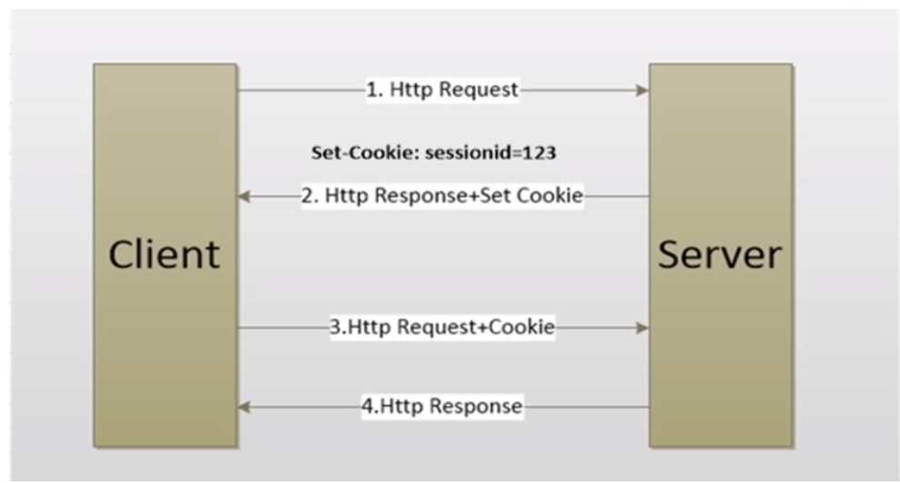
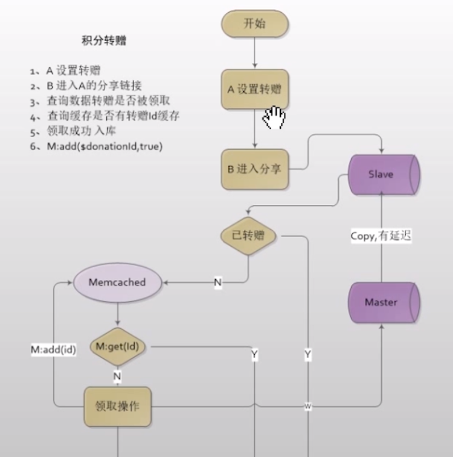

# Memcached-Study
Memcached Study

## Memcached
内存对象缓存系统 KEY:VALUE存储
- 数据缓存
- 存储session
- 短信验证码存储

## [安装:Memcached](./docs/install.md)
- linux编译安装很多坑啊
``` 
    install libevent
    ./contigure --prefix=/usr
    make && make install
    install memcached
    ./configure --prefix=/usr/loacl/mecacched --whit-libevent=/usr
    make && make install
```
    
## [Memcached常用命令](./docs/basic_command.md)
- set
```
    set demo 0 900 5 [noreply]
    hello
    注意,你value的长度必须为设定的长度
```
- get 
``` 
    get key1 key2 key3
    依次返回不存在 返回 空
```
- gets
``` 
    gets key1 key2
    会多返回一个token
    注释:每次设置一个值token的值会改变
```
- delete
``` 
    delete key [noreply]
```
- prepend
- append
```
    prepend 在存在的key前面追加数据
    append 在存在的key末尾追加数据
    prepend key flags exptime buytes [noreply]
    value
    
    set demo 0 900 5
    world
    
    prepend demo 0 900 5
    hello
    
    append demo 0 900 9
    memcached
    
    get demo
    VALUE demo 0 19
    helloworldmemcached
```
- incr
- decr
```
    incr 自增
    decr 自减
    只能使用在十进制32位无符号整数
    incr key value
    decr key value
    
    set num1 0 900 12
    incr num1 2
    decr num1 2
```
- add
``` 
    秒杀 库存
    当K存在的时候不会存储 返回NOT_STORED
    
    add key flags exptime bytes [noreply]
    value
    
```
- cas
``` 
    保存数据一致性 cas_token  "检查并设置" 当客户端最后一次取值,值未被其他客户端修改查能够将值写入
    cas key flags exptime bytes unique_cas_token [noreply]
    value
    return EXISTS存在
```

>常见返回
- `STORED` 成功
- `NOT_STORED` 失败
- `CLIENT_ERROR` 错误

### php Memcached扩展
``` 
    curl -O https://launchpad.net/libmemcached/1.0/1.0.18/+download/libmemcached-1.0.18.tar.gz
    ./configure --prefix=/usr/local/libmemcached --with-memcached
    make && make install
```

### Memcached存储session

- 修改php.ini 
    - `session.save_path`
    - `session.save.handle`
    - `session.gc_maxlifetime`
    - `[session.name]`
    - 弊端,多demo时处理麻烦
- 在code里设置文件
    - `ini_set()`
``` 
//设置session储存介质为memcached
ini_set('session.save_handler','memcached');

//设置session储存memcached服务器的端口地址
ini_set('session.save_path','127.0.0.1:11211');

//设置cookie名称
ini_set('session.name','dollar_id');

//设置session生存时间
ini_set('session.gc_maxlifetime',3600);

//设置session存储在memcached key前缀
ini_set('memcached.sess_prefix','memc.dollar.');

session_start();  
```        

### Memcached类的使用
- 常用方法
- 封装Memcache类

#### 添加memcached
``` 
$cache = new Memcached('dollar');

//重置服务器地址池
//$cache->resetServerList();

if(!$cache->getServerList())
{
    $cache->addServers(  //不会排重
        array(
            array('127.0.0.1',11211,60),//ip 地址 权重 对应服务器池中服务器权重(服务器被选中的概率,越大机率越高)
//            array('127.0.0.1',11311.40)
        )
    );
}


$serverList = $cache->getServerList();//获取服务器地址
//var_dump($serverList);
```
#### 设置缓存
```
//设置缓存
//$cache->set();  //一次性增加一条记录
$result = $cache->setMulti(   //通过数组的形式增加 (array,)  过期时间为时间戳
    [
        'key1'=>'value1',
        'key2'=>'value2',
        'key3'=>'value3',
    ],time()+900
);
var_dump($result);
```
#### 取缓存
```
//取缓存
//$cache->get();    //一次取一对 KEY:回调函数
$result = $cache->getMulti([  // 传入数组 批量获取  $cas cas_totals
'key1','key2','key3'
],$cas
);

var_dump($result,$cas);
```
#### cas 数据唯一性  多服务器 并发 唯一性验证 
```
//cas 数据唯一性  多服务器 并发 唯一性验证
$result = $cache->get('key1',null,$cas);//key,回调函数,cas

sleep(10);
var_dump($result,$cache);

if (!$cache->cas($cas,'key1','hello',time()+900))
{
    var_dump($cache->getResultMessage());//getResultMessage()返回变更失败的返回值
}

$result = $cache->get('key1',null,$cas);

var_dump($result);
```
#### add 抢座 秒杀
```
//add 抢座 秒杀
if (!$cache->add('key.add','1',time()+900))
{
    echo '不对其,作为被占用了';
}else
{
    echo '抢座成功';
}
```
#### increment 自增 decrement 自减
```
//increment 自增 decrement 自减
$cache->set('k.no',0,time()+900);
var_dump($cache->increment('k.no',2)); //(key,offset步长) 返回值成功最好一个key的值 失败返回false
var_dump($cache->decrement('k.no',1));
```
#### prepend()前追加 append()后追加
```
// prepend()前追加 append()后追加

$cache->setOption(memcached::OPT_COMPRESSION,false);//使用追加要关闭压缩

$cache->set('k.s','World',time()+900);
$cache->replace('k.s','Hello '); //返回bool
$cache->append('k.s',' Memcached');

$result = $cache->get('k.s');
var_dump($result);
```

### [memcache类封装](./lib/MemCache.php)

### Memcached在项目中的使用场景
- Session存储
- [缓解数据库压力,提高交互速度](./TEST/缓解数据库压力,提高交互速度DEMO/lib/MemCache.php)
- 数据库主从同步中继  增删改在主库查询在从库`[拷贝延迟]`

- [主从同步伪代码](./TEST/主从同步)


